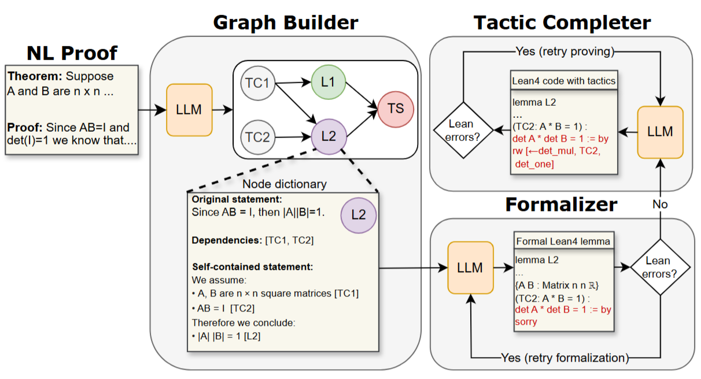

# ProofFlow

[](https://www.python.org/downloads/)
[](https://opensource.org/licenses/MIT)

Formalizing mathematical proofs is a critical step for ensuring logical rigor, but the manual effort required is immense. Landmark projects like the 20-year formalization of the Kepler Conjecture and the ongoing efforts for Fermat's Last Theorem highlight this challenge.

**Proof autoformalization**—the task of automatically converting natural language (NL) proofs into machine-verifiable code like Lean 4—is a promising solution. However, this is a difficult and relatively new area of research. 

**ProofFlow** is a Python package that implements our novel, state-of-the-art pipeline to address this challenge. It translates NL proofs into verifiable Lean 4 code by first constructing a dependency graph to map the proof's logical flow. This ensures the final output is not only correct but also **structurally faithful** to the author's original reasoning.


<div style="text-align: center;">
  <figure>
    <p align="center">
    
    </p>
    <figcaption>
      <p align="center">
The ProofFlow pipeline offers superior performance because of its new lemma-based structure and by enforcing the proof's Directed Acyclic Graph (DAG) during the formalization process.      </p>
    </figcaption>
  </figure>
</div>


## 🚀 Features

- **Intelligent Proof Graph Generation**: Automatically decomposes natural language proofs into structured dependency graphs.
- **Lean 4 Integration**: Generates valid Lean 4 code with automatic verification.
- **Multi-Model Support**: Compatible with various LLMs including Claude, GPT, Gemini, and custom vLLM servers.
- **Interactive Visualizations**: Creates interactive proof dependency graphs.
- **Comprehensive Score**: Evaluates the quality of formalized proofs using our novel AI-powered metric, **ProofScore**.
- **Error Analysis**: Provides comprehensive error detection and analysis for debugging formalizations.

<div style="text-align: center;">
  <figure>
    <p align="center">
    
    </p>
    <figcaption>
      <p align="center">
          Our proof autoformalization pipeline with three parts: (1) Graph builder; (2) Lemma Formalizer; and (3) Tactic Completer. Lean errors are verified by the Lean 4 compiler.
      </p>
    </figcaption>
  </figure>
</div>

    
## 📦 Installation

### Prerequisites

- Python 3.8 or higher
- Lean 4 (for local verification) or access to a Lean server

### Install from Source

```bash
git clone https://github.com/Huawei-AI4Math/ProofFlow.git
cd ProofFlow
pip install -e .
```

## 🚀 Quick Start

### Basic Usage

```python
from proofflow import ProofFlow, LLMManager, LeanServer

# Set up Lean server (local or remote)
lean_server = LeanServer(api_url="http://localhost:14457")  # Remote server
# OR
# lean_server = LeanServer(project_path="/path/to/mathlib")  # Local project

# Configure LLM models
graph_model = LLMManager(
    model_info={
        "api_key": "your-api-key",
        "base_url": "your-base-url",
        "model": "your-model-name",
    },
    system_prompt_path="prompts/proof_graph.md",
)

formalize_model = LLMManager(
    model_info={
        "api_key": "your-api-key",
        "base_url": "your-base-url",
        "model": "your-model-name",
    },
    system_prompt_path="prompts/lemma_formalizer.md",
)

solver_model = LLMManager(
    model_info={
        "api_key": "your-api-key",
        "base_url": "your-base-url",
        "model": "your-model-name",
    },
    system_prompt_path="prompts/lemma_prover.md",
)

# Initialize ProofFlow
proof_flow = ProofFlow(
    lean_server=lean_server,
    graph_model_manager=graph_model,
    formalize_model_manager=formalize_model,
    solver_model_manager=solver_model,
    verbose=True
)

# Process a natural language proof
nl_proof = """
Theorem: For all real numbers x, y, if x² + y² = 1, then |x| ≤ 1.
Proof: Since x² ≥ 0 and y² ≥ 0, we have x² + y² ≥ x². 
Given that x² + y² = 1, we get 1 ≥ x², which means x² ≤ 1. 
Taking the square root of both sides, we obtain |x| ≤ 1.
"""

# Run formalization
proof_flow.autoformalize_series(nl_proof)

# Get results
lean_code = proof_flow.get_lean_code()
print(lean_code)

# Generate visualizations
proof_flow.plot_dag("proof_dag.png")
proof_flow.interactive_dag("proof_dag.html")

# Get performance summary
summary = proof_flow.summary()
print(f"Formalization accuracy: {summary['form_acc']:.2%}")
print(f"Proof success rate: {summary['solv_acc']:.2%}")
```


## 📊 Advanced Features

### Visualization

```python
# Create static proof graph
proof_flow.plot_dag("proof_structure.png")

# Create interactive HTML visualization
proof_flow.interactive_dag("interactive_proof.html")
```

<div style="text-align: center;">
  <figure>
    <p align="center">
     
    </p>
    <figcaption>
      <p align="center">
          Interactive visualization of the proof. Node contours signify the outcome of each step: Red for a formalization error, orange for formalized statement without Lean 4 tactics, and green for formalized statement with Lean 4 tactics.
      </p>
    </figcaption>
  </figure>
</div>


### Semantic Scoring

```python
# Compute proof score
proof_flow.proof_score()
print(f"Total proof score: {proof_flow.total_score}")
```

### Error Analysis

```python
# Perform comprehensive error analysis
proof_flow.error_analysis()

# Access error reports for each proof step
for item in proof_flow.proof_items:
    if hasattr(item, 'error_report'):
        print(f"Step {item.id}: {item.error_report['error_type']}")
```


## 🧪 Benchmarking and Reproducibility

To benchmark the Goedel Formalizer and Solver, run the benchmark.sh script. This script automates the entire process, but it's very time-consuming and can take several days to complete.

Before you start, you'll need to fill out the .env file with the necessary API keys and URLs for your services. This includes the OpenAI API, as well as the Goedel Formalizer and Solver (including their model locations), and the Lean server. An example .env file is left on the main folder, with the API key field left blank for you to fill in.

Due to potential connection timeouts and rate limits with some services, it's a good idea to run the commands in benchmark.sh one by one in your terminal. Once the script finishes, the results—including autoformalization files (.pickle, .html) and summary tables (.xlsx)—will be stored in the benchmark_results/ folder.

## 📈 Performance Metrics

ProofFlow tracks detailed performance metrics:

- **Formalization Accuracy**: Percentage of successfully formalized proof steps
- **Proof Success Rate**: Percentage of steps that can be automatically proven
- **ProofScore**: A novel composite score for the whole proof formalization, taking into account semanting similarity between natural language and Lean code
- **Token Usage**: Total tokens consumed across all LLM calls
- **Processing Time**: Time breakdown by model and operation


## 📄 License

This project is licensed under the MIT License - see the [LICENSE](LICENSE) file for details.


**ProofFlow** - Bridging the gap between informal mathematics and formal verification.


